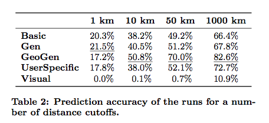

MediaEval 2011 Runs
===================
This folder contains the result files when running version v0.2 (GitHub tag) of the software on the MediaEval 2011 Placing Task data set.

For these experiments, we used the `tags` and `title` information of each training/test item as well as the user's provided home location (if available) to place those test items that did not have any tag/title information associated with them.
The code assumes that the user's home location is stored as metadata in the index and associated with the XML element `<USERLOCATION>`. This location data is taken as-is from the Flickr profile, i.e. a typical entry looks as follows: `<USERLOCATION>Los Angeles, USA, earth</USERLOCATION>`. These entries are parsed on the fly by the program.
Since the MediaEval data set also came with Flickr accuracy values for each training item, the parameter file also contains the option to only train on data of a particular accuracy. For this to work, the accuracy value of each item is stored in the index's metadata. A typical entry in the documents to be indexed looks as follows: `<ACCURACY>11</ACCURACY>`.

Although there are 5347 test items in the data set, a few of them are duplicates, and the result file - correctly - evaluate 5336 test items (ignoring the duplicate entries).

The results provided here approximately the same as reported in http://ceur-ws.org/Vol-807/Hauff_WISTUD_Placing_me11wn.pdf (the original working notes paper where parts of the code were first used) - due to code changes over time, the results are not exactly the same. The trends though hold. To make the comparison easier, the results of that paper are shown below:
 
 

Each result file contains three types of data:
* the parameter file that was used to generate the results
* basic statistics about the number of training/test data elements (e.g. if minAccuracy is set to a high value in the parameter file, less training data is available)
* the location estimates of each individual test item, as well as its ground truth and the distance between the two points

The result files, that correspond to the table above, are as follows:

* `res.baseline` corresponds to the Basic run in the table
* `res.geogen` corresponds to the GeoGen run in the table
* `res.gen` corresponds to the Gen run in the table

To show the influence of various parameter settings, a number of additional runs were created:

* `res.excludeTestUsers` has the same parameter settings as `res.baseline` with the only exception of `<excludeTestUsers>` which is set to `true`. This means that all training images in the MediaEval 2011 data set that come from test users (users contributing to the test set) are ignored. This reduces the amount of training data only slightly (from ~2.96 million images/videos to ~2.71 million) but increases the median error considerably (from 78km to 324km).
* `res.higherLevelNodes4` has the same parameter settings as `res.baseline` with the exception of `<higherLevel>` which is set to 4. This means, that in the first round, a small number of large regions are evaluated and in the second round, only the child regions of the best performing large region are further evaluated. This is not necessary for the MediaEval data set (as it is small), however when training on a hundred million images, not all region language models can be kept in memory at the same time. Here, the first round region models are always kept in memory, while the second round region models are computed on the fly. Usually, the error increases, depending on what the chosen `higherLevel` is - the higher, the more fine-grained the regions in the first step and the more accurate the results. At setting 4, the median error is 387km.  
* `res.higherLevelNodes8` is the same as above but with `<higherLevel>` set to 8. The median error is now 116km (instead of 78km for `res.baseline`). The result file also contains the number of higher-level nodes (1199) and the total number of leaf nodes (1844). Thus, instead of keeping 1844 region language models in memory, only 1199 region language models are kept in memory.  
* `res.skipModulos3` is the same as `res.baseline` with the exception of the `<skippingModulos>` parameter which is set to 3. This means, that only a third of the training data is used and as expected, the median error increases slightly to 79.86km (from 78km in `res.baseline`). The larger the parameter, the more training data elements are skipped, at 10 (i.e. using 1/10th of the training data or roughly 296000 items), the median error increases to 168km. 
